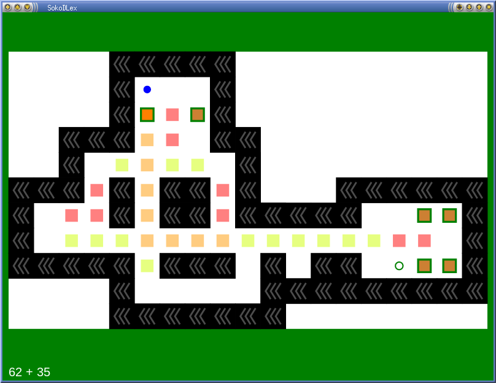

# SokoDLex
Sokoban Deadlock Examiner

 

## Description

SokoDLex is a tool for solving Sokoban levels, and examining its deadlocks.
Unlike other sokoban programs, SokoDLex is not finding the deadlocks by itself
but allows user to prove that such box configurations indeed form a deadlock
by examining all possible moves. A deadlock is given by positions of boxes,
and 'blocked squares' -- positions where it is known that there is no box, these
can be useful for deadlocks in storage packing.

## Dependencies
+ Python3
+ [pyGtk3](https://pygobject.readthedocs.io/en/latest/getting_started.html)
+ [numpy](https://pypi.org/project/numpy/) (on Windows: "pacman -S mingw-w64-x86_64-python3-numpy")

## Controls

|Mouse Button |Action  |
--- | --- 
| Left | move boxes |
| Middle | move storekeeper |
| Right | hide / show a box, block / unblock a square |

|Key |Action  |
--- | --- 
| Arrows | Classical sokoban moves |
| Backspace, 'z' | Undo |
| '=', 'Z' | Redo |
| Enter, 'r' | Undo to beginning |
| shift+Enter, 'R' | Redo to end |
| Space | Swap to dual mode |
| 'p' | Play randomly with a tendency to push boxes towards storages |
| 's' | If there is an available move, apply it, otherwise store a deadlock go back |
| 'S' | Repeat search steps |
| 'a' / 'A' | Enable all boxes / all squares |
| 'x' / 'X' | Invert all boxes / all blocked squares |
