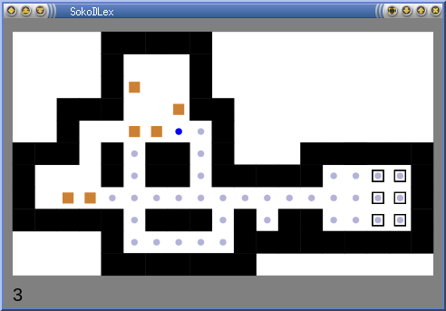

# SokoDLex
Sokoban Deadlock Examiner

## Description

SokoDLex is a tool for solving Sokoban levels, and examining its deadlocks.
Unlike other sokoban programs, SokoDLex cannot find deadlocks by itself
but allows user to prove that such box configurations indeed form a deadlock
by examining all possible moves. A deadlock is given by positions of boxes,
and 'blocked squares' -- positions where it is known that there is no box, these
can be useful for deadlocks in storage packing.

 

## Dependencies
+ Python3
+ [pyGtk3](https://pygobject.readthedocs.io/en/latest/getting_started.html)
+ [numpy](https://pypi.org/project/numpy/) (on Windows: "pacman -S mingw-w64-x86_64-python3-numpy")

## Controls

|Mouse Button |Action  |
--- | --- 
| Left | move boxes |
| Middle | move storekeeper |
| Right | hide / show a box, block / unblock a square |

|Key |Action  |
--- | --- 
| Arrows | Classical sokoban moves |
| Backspace, 'z' | Undo |
| '=', 'Z' | Redo |
| Enter, 'r' | Undo to beginning |
| shift+Enter, 'R' | Redo to end |
| Space | Swap to dual mode |
| 'd' | Play randomly with a tendency to push boxes towards storages |
| 's' | If there is an available move, apply it, otherwise store a deadlock go back |
| 'S' | Repeat search steps |
| 'a' / 'A' | Enable all boxes / all squares |
| 'x' / 'X' | Invert all boxes / all blocked squares |

## Example usage

Press 'd' to let SokoDLex try some moves.

Press 'x' hide all boxes

Select a deadlock with the right button.

Press 's' to let SokoDLex examine the current position. If there are no available moves,
sokodlex will go back in undo history to a position not blocked by this deadlock,
and try another move.

Continue marking deadlocks this way while you see them, or just letting SokoDLex play when you don't see them. After marking 15 deadlocks, I ended up in the following state (but the random play is undeterministic).

Random play refuses to continue because it doesn't want to repeat a state which is already in the undo history. So let's just backtrack from the state with the 's' key, and run 'd' again. Finally, the level is solved.

## Lean Export

Python scripts `mov_sol_to_lean.py`, and `deadlocks_to_lean.py`
can be run on data produced in the `var`
directory of SokoDLex. They produce a Lean code for
[sokoban.lean](https://github.com/mirefek/sokoban.lean).